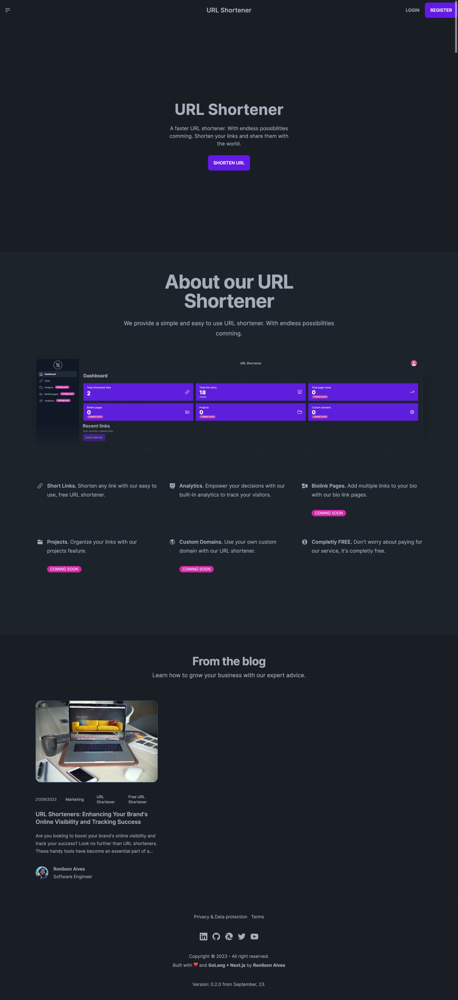
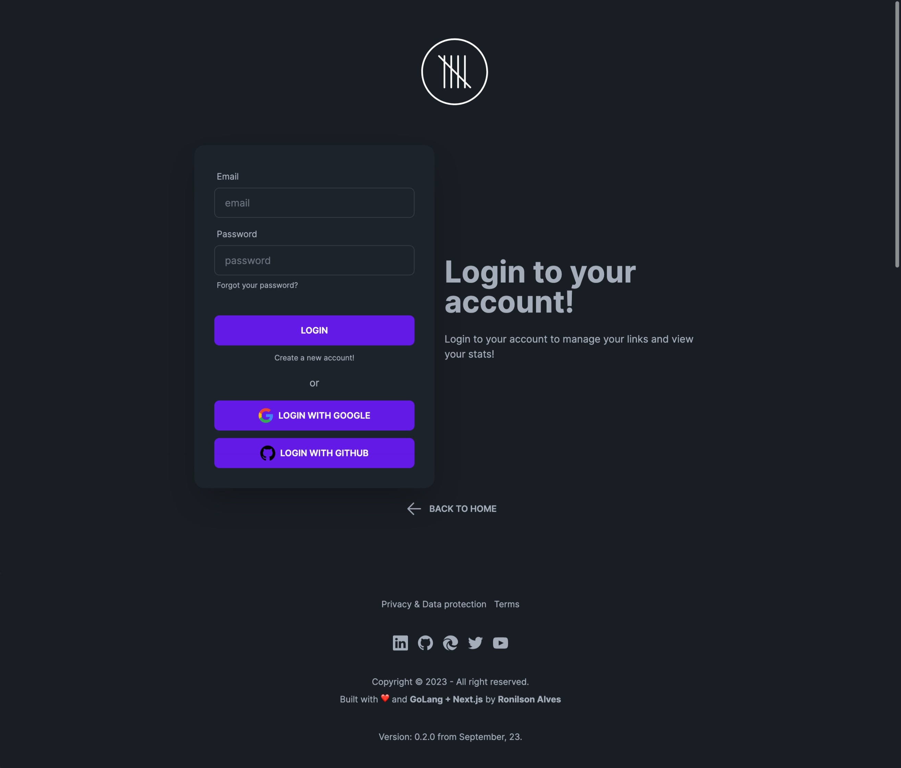
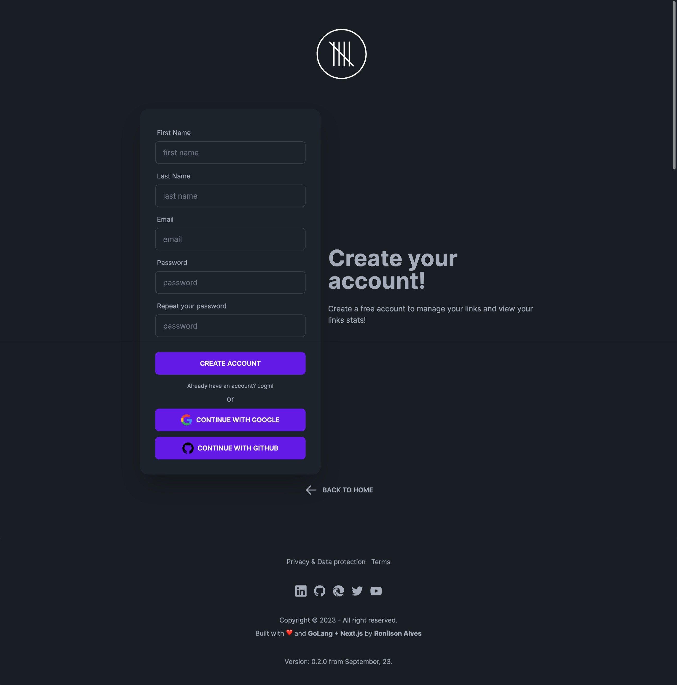
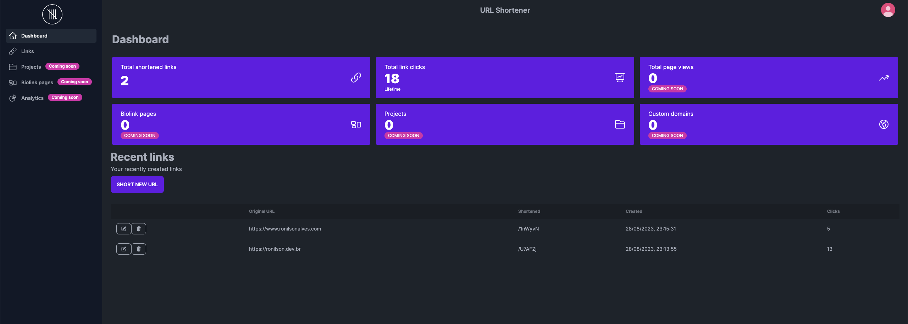

# 5lnk – URL Shortener

5lnk is a URL Shortener built in Golang with Next.js to be simple and faster. With endless possibilities coming.

## Table of contents
- [About](#about)
- [Tech Stack](#tech-stack)
- [Screenshots](#screenshots)
- [Roadmap](#roadmap)
- [Contributing](#contributing)
- [Licence](#license)

## About
This project started as a way to practice my Golang skills and learn more about TypeScript and new App Router from Next.js 13.
Currently, I'm working in new features such a page of links, theme and language selection – you can see more at the project [Roadmap](#roadmap).

## Tech Stack
### Backend Technologies
- Go Lang
- Gin Web Framework
- GORM
- PostgresSQL
- Redis
- Firebase Admin SDK
- Swag (Swagger 2.0)

### Frontend Technologies
- TypeScript
- Next.js
- TailwindCSS
- DaisyUI
- Contentlayer

### DevOps / Deploy
- Docker
- Fly.io
- Vercel

## Screenshots
>Home page: 

> Login page: 
 
> Register page: 
 
>Dashboard: 

## Roadmap
Bellow you can see what is  planned for future implementation.

- [ ] Change to server actions instead hooks.
- [ ] Implement feat to allow users to build link pages.
- [ ] Implement alias for URL shortened
- [ ] Improve analytics system
- [ ] Implement Theme switch
- [ ] Add internationalization
- [ ] Automatize the deployment to my kubernetes cluster.

## Contributing
<i>Details soon</i>

## License
<i>Details soon</i>